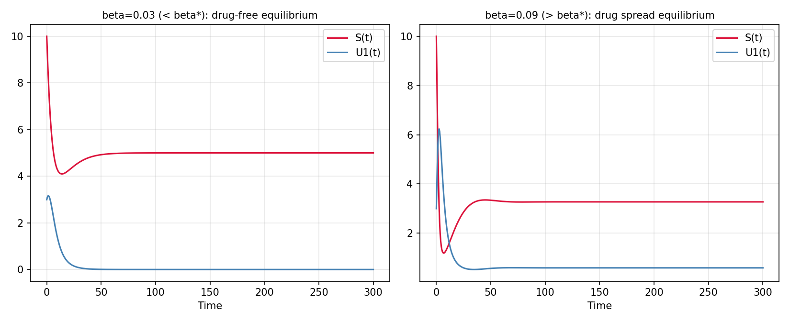

# Age-Structured Heroin Epidemic Model with Treatment Delay

A numerical simulation of a mathematical epidemic model, based on my Master's thesis
in Biomathematics (*Age-Structured Heroin Transmission Model With Delay*, University
Djillali Liabès, 2026).

## What this shows

The model treats heroin addiction the way epidemiologists model infectious disease
spread: a population is split into **susceptibles**, **untreated users**, and
**treated users** (tracked by how long they've been in treatment). Individuals in
treatment can relapse back into untreated use, and the model captures how a delay
(finite treatment duration) affects whether the "epidemic" dies out or persists.

The key result is a threshold value **β\*** (the transmission rate threshold):
- If the actual transmission rate β is **below** β\*, heroin use dies out over time
  (the "drug-free equilibrium").
- If β is **above** β\*, heroin use persists at a stable, nonzero level (the
  "drug spread equilibrium").

This script reproduces that comparison numerically and verifies the simulation
against the model's closed-form equilibrium formulas.

## Result



**Left**: β = 0.03 (below threshold) — susceptible population S(t) recovers to its
natural level (Λ/μ = 5), and untreated users U1(t) die out.

**Right**: β = 0.09 (above threshold) — both populations settle into a stable,
nonzero "endemic" equilibrium instead.

The simulated equilibrium values match the thesis's analytic formulas almost
exactly:

| β    | R₀    | Simulated (S, U₁) | Analytic (S\*, U₁\*) |
|------|-------|--------------------|------------------------|
| 0.03 | 0.509 | (5.000, 0.000)     | (5.000, 0.000)         |
| 0.09 | 1.528 | (3.270, 0.588)     | (3.273, 0.586)         |

## How it works

The model is a system of ODEs coupled to an age-structured PDE (tracking
treated users by time-in-treatment). The PDE is solved using the **method of
lines**: the treatment-duration axis is discretized into a fine grid, turning
the PDE into a large system of ODEs, which is then solved alongside the S(t)
and U1(t) equations using `scipy`'s stiff ODE solver (`BDF`).

## Files

- `simulate.py` — the full simulation, parameter setup, and plotting code
- `simulation_result.png` — the generated comparison plot

## Run it yourself

```bash
pip install numpy scipy matplotlib
python simulate.py
```

## Background

Full mathematical details (model derivation, stability proofs, reproduction
number calculation) are in the accompanying thesis. This project focuses on
independently reproducing and numerically verifying the thesis's key
simulation result.
